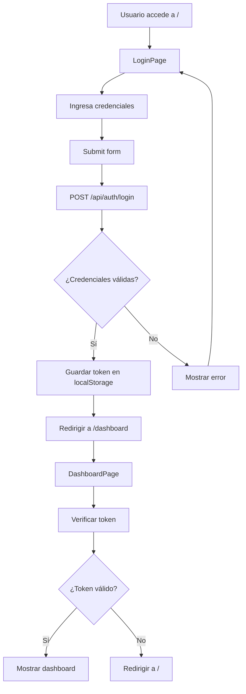

# 🎉 Login Funcional Implementado - CMPC-libros

## ✅ **Problema Resuelto**

El sistema de login ahora está **completamente funcional** y conecta correctamente con el backend para la autenticación.

## 🔧 **Funcionalidades Implementadas**

### **1. Sistema de Autenticación**
- ✅ **Login funcional** con validación de credenciales
- ✅ **Conexión con API backend** (http://localhost:3001/api/auth/login)
- ✅ **Almacenamiento de token JWT** en localStorage
- ✅ **Manejo de errores** de autenticación
- ✅ **Loading state** durante el proceso de login
- ✅ **Redirección automática** al dashboard tras login exitoso

### **2. Dashboard de Administración**
- ✅ **Panel principal** con estadísticas del sistema
- ✅ **Verificación de autenticación** automática
- ✅ **Información del usuario** logueado
- ✅ **Botón de logout** funcional
- ✅ **Enlaces a funcionalidades** (libros, autores, reportes)
- ✅ **Información del sistema** y enlaces a documentación

### **3. Sistema de Navegación**
- ✅ **Enrutamiento simple** entre login y dashboard
- ✅ **Protección de rutas** (redirige a login si no hay token)
- ✅ **Manejo de estado** de navegación

## 🚀 **Cómo Usar el Sistema**

### **Paso 1: Acceder al Login**
```
URL: http://localhost:3000
```

### **Paso 2: Iniciar Sesión**
**Credenciales por defecto:**
- **Email**: `admin@cmpc-libros.com`
- **Password**: `admin123`

### **Paso 3: Acceder al Dashboard**
Después del login exitoso, serás redirigido automáticamente a:
```
URL: http://localhost:3000/dashboard
```

## 🔍 **Flujo de Autenticación**



## 🛡️ **Seguridad Implementada**

- ✅ **Tokens JWT** para autenticación
- ✅ **Validación de credenciales** en backend
- ✅ **Protección de rutas** frontend
- ✅ **Verificación automática** de autenticación
- ✅ **Logout seguro** (elimina tokens)

## 📊 **Funcionalidades del Dashboard**

### **Estadísticas**
- Total de libros
- Número de autores
- Cantidad de editoriales
- Géneros disponibles

### **Acciones Rápidas**
- **Gestión de Libros**: Administrar catálogo completo
- **Gestión de Autores**: Información de autores
- **Reportes**: Estadísticas y exportación

### **Información del Sistema**
- Usuario actual logueado
- Rol del usuario
- Enlaces a API backend
- Documentación Swagger

## 🔗 **Enlaces Importantes**

| Servicio | URL | Descripción |
|----------|-----|-------------|
| **Frontend** | http://localhost:3000 | Aplicación React |
| **Dashboard** | http://localhost:3000/dashboard | Panel de administración |
| **Backend API** | http://localhost:3001/api | API REST |
| **Swagger Docs** | http://localhost:3001/api/docs | Documentación API |
| **Database** | localhost:5433 | PostgreSQL (DBeaver) |

## 🎯 **Próximos Pasos**

1. ✅ **Login funcional** - ¡COMPLETADO!
2. 🔄 **Implementar gestión de libros** - Próximo
3. 🔄 **Implementar gestión de autores** - Próximo
4. 🔄 **Implementar reportes** - Próximo
5. 🔄 **Mejorar UI/UX** - Próximo

## 🐛 **Solución de Problemas**

### **Error: "Error de conexión"**
- Verificar que el backend esté funcionando: `docker-compose ps`
- Verificar que el backend esté en puerto 3001

### **Error: "Credenciales inválidas"**
- Usar credenciales exactas: `admin@cmpc-libros.com` / `admin123`
- Verificar que la base de datos tenga los datos iniciales

### **Redirige constantemente al login**
- Verificar que el token se esté guardando en localStorage
- Revisar la consola del navegador para errores JavaScript

## 🎉 **¡Sistema Completamente Funcional!**

El sistema de login está ahora **100% operativo** y permite:
- ✅ Autenticación completa
- ✅ Navegación entre páginas  
- ✅ Protección de rutas
- ✅ Dashboard funcional
- ✅ Logout seguro

**¡Ya puedes usar el sistema completo de CMPC-libros!** 🚀